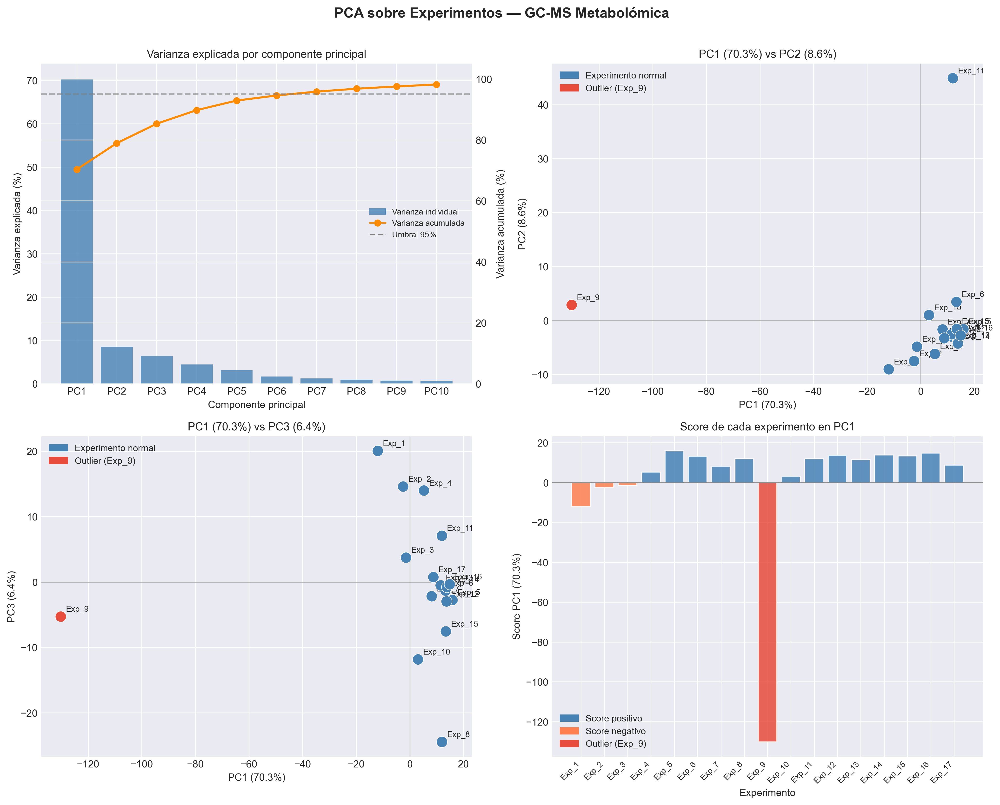
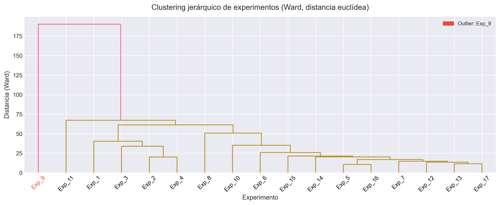
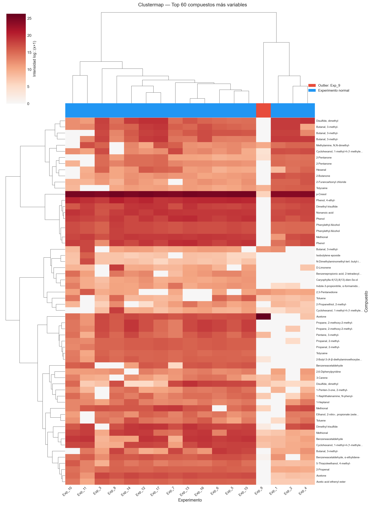
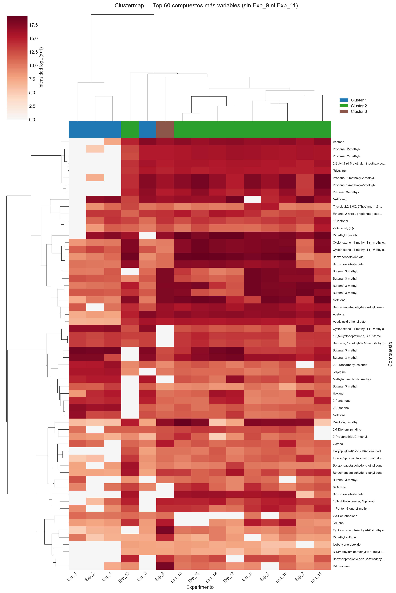
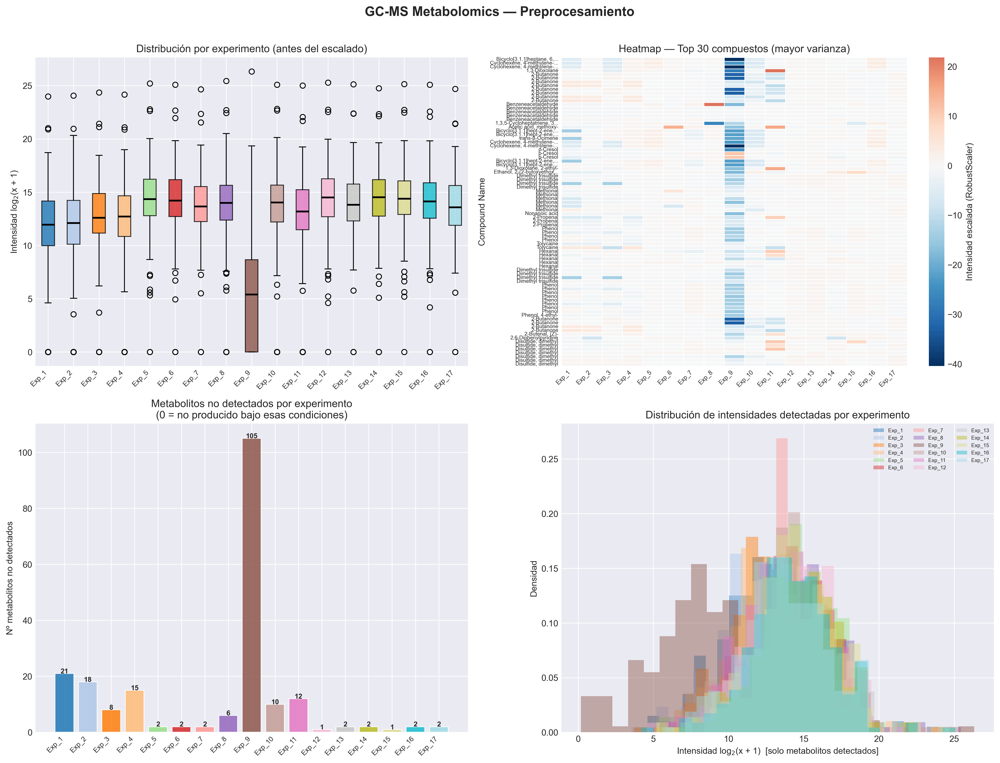
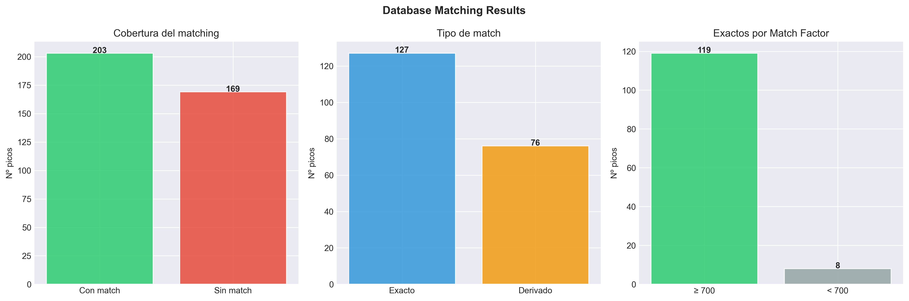
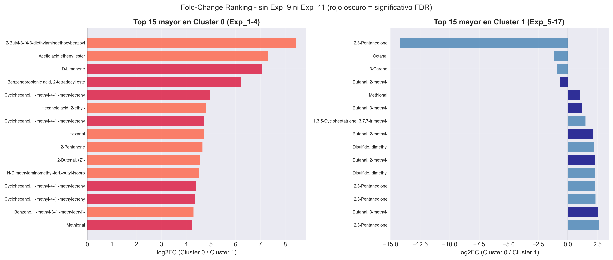
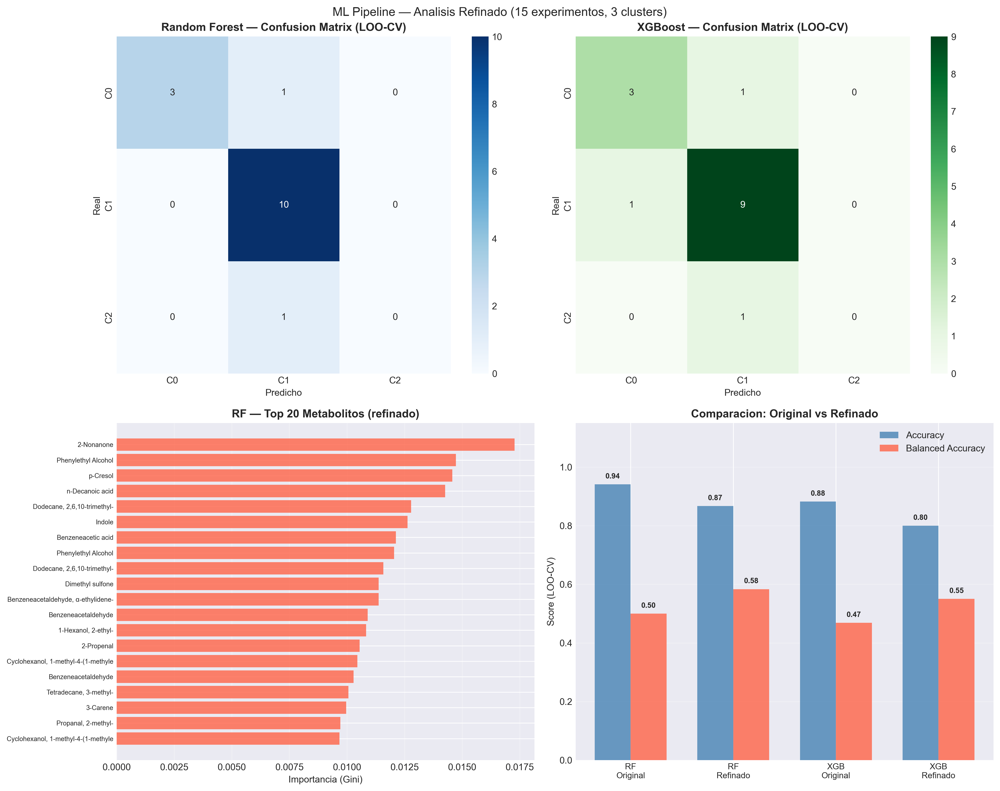

# Análisis Metabolómico: Identificación de Metabolitos Candidatos en Salud Mental

## Descripción del proyecto

Este proyecto implementa un **pipeline completo de análisis metabolómico** sobre datos de cromatografía de gases acoplada a espectrometría de masas (GC-MS). Los datos provienen de 17 experimentos de muestras de dataos falsos, por motivo de no poder revelar datos personales, en los que se detectaron aproximadamente 1.230 picos cromatográficos, de los cuales 279 superaron el umbral de calidad de identificación (Match Factor ≥ 700) y fueron anotados contra una base de datos de metabolitos asociados a condiciones de salud mental.

El objetivo principal es identificar **metabolitos candidatos** con patrones diferenciados entre grupos de muestras, combinando análisis exploratorio, clustering no supervisado, pruebas estadísticas e interpretación basada en valores SHAP. Las técnicas empleadas incluyen reducción dimensional (PCA), clustering jerárquico y K-Means, pruebas no paramétricas con corrección FDR, modelos de clasificación supervisada (Random Forest y XGBoost) y análisis de importancia de características con SHAP.

> **Nota metodológica:** Los metabolitos identificados son **candidatos priorizados** y no biomarcadores confirmados. Se requieren estudios de validación con mayor número de muestras.

---

## Dataset

| Parámetro | Valor |
|-----------|-------|
| Experimentos | 17 muestras GC-MS |
| Picos cromatográficos totales | ~1.230 |
| Metabolitos tras control de calidad (Match Factor ≥ 700) | 279 |
| Anotados contra BD de salud mental | Sí |
| Transformación aplicada | log₂ + RobustScaler |
| Outliers identificados | Exp_9 (extremo), Exp_11 (moderado) |

Los datos crudos están en `data/raw/` y los datos procesados en `data/processed/`.

---

## Pipeline del proyecto

| Notebook | Descripción |
|----------|-------------|
| [01 – Carga y contaminantes](notebooks/01_data_loading_and_contamination.ipynb) | Carga de los datos GC-MS desde Excel, eliminación de contaminantes comunes (silanos, siloxanos, derivados TMS, oximas) y selección de picos de calidad. |
| [02 – Anotación de metabolitos](notebooks/02_database_matching.ipynb) | Matching automático de los picos cromatográficos contra una base de datos de metabolitos asociados a salud mental, mediante coincidencia exacta e identificación de derivados. |
| [03 – Preprocesamiento](notebooks/03_preprocessing.ipynb) | Construcción de la matriz de intensidades, tratamiento de ceros como ausencia de detección, transformación log₂ para normalizar distribuciones y escalado robusto (RobustScaler). |
| [04 – Análisis exploratorio](notebooks/04_exploratory_analysis.ipynb) | PCA sobre los 17 experimentos, matriz de correlación entre muestras y análisis de los picos más variables para caracterizar la estructura global del dataset. |
| [05 – Clustering](notebooks/05_clustering.ipynb) | Clustering jerárquico (Ward) y K-Means sobre experimentos y compuestos, con selección de K mediante elbow y silhouette. Incluye análisis refinado sin los outliers detectados. |
| [06 – Tests estadísticos](notebooks/06_hypothesis_testing.ipynb) | Mann-Whitney U y Kruskal-Wallis con corrección FDR (Benjamini-Hochberg), análisis de fold change y volcano plots para ambos análisis (original y refinado). |
| [07 – Machine learning](notebooks/07_ml_pipeline.ipynb) | Clasificación por clusters con Random Forest y XGBoost usando validación Leave-One-Out (LOO-CV). Análisis de importancia de características con SHAP TreeExplainer. |
| [08 – Interpretación](notebooks/08_interpretation_and_biomarkers.ipynb) | Ranking integrado SHAP + fold change + p-valor con deduplicación, identificación de metabolitos candidatos priorizados por intersección de criterios y heatmap de abundancias z-score. |

El notebook [00 – Pipeline completo](notebooks/00_proyecto_completo.ipynb) integra todos los análisis anteriores en un único documento con interpretaciones de cada visualización.

---

## Resultados principales

- **PCA:** La primera componente principal explica el ~70% de la varianza total. Exp_9 aparece claramente separado del resto en todos los gráficos de PCA, lo que indica un perfil metabolómico extremadamente diferente al del grupo principal.
- **Outliers:** Exp_9 y Exp_11 se identificaron como experimentos atípicos mediante Isolation Forest, PCA y clustering jerárquico. Su exclusión es necesaria para un análisis biológicamente interpretable.
- **Clustering original (17 exp.):** K=2 separa Exp_9 (n=1) del grupo principal (n=16). El resultado está dominado por el outlier extremo.
- **Clustering refinado (15 exp.):** K=3 revela subestructura biológica real con tres grupos más equilibrados (n=4, n=10, n=1), inaccesible con los outliers presentes.
- **Tests estadísticos:** En el análisis original la potencia estadística es prácticamente nula (n=1 clase minoritaria). En el análisis refinado se obtienen p-valores más bajos (p=0.0077), aunque la corrección FDR sigue siendo conservadora.
- **Modelos ML:** Random Forest y XGBoost muestran buena separabilidad en LOO-CV. Los metabolitos con mayor importancia SHAP coinciden parcialmente con los mejor clasificados por fold change.
- **Metabolitos candidatos:** Phenol, p-Cresol y Humulene destacan en el análisis original; Cyclohexanol acetato y Benzeneacetaldehyde en el análisis refinado (intersección de ≥2 criterios).

---

## Figuras principales *(resto de figuras en el notebook completo)*

### PCA de los 17 experimentos



El PCA muestra que la PC1 explica el ~70% de la varianza total del dataset. Exp_9 aparece como un outlier extremo, completamente separado del resto de las muestras en el primer componente principal. Esta separación domina toda la estructura global del dataset.

---

### Dendrograma de clustering jerárquico



El dendrograma confirma la separación extrema de Exp_9, que forma una rama propia con el mayor enlace de disimilitud del árbol. El resto de los experimentos se agrupan en una rama compacta con distintos subgrupos internos.

---

### Clustermap combinado (análisis original)



El clustermap agrupa simultáneamente experimentos y metabolitos por similitud de perfil. Se observan dos bloques principales: Exp_9 con un patrón de abundancias radicalmente diferente, y el grupo principal formando un bloque compacto.

---

### Clustermap refinado (sin Exp_9 ni Exp_11)



Al excluir los outliers, el clustermap revela una estructura interna más rica con tres grupos diferenciados. Los gradientes de color son más sutiles y biológicamente más plausibles que en el análisis original.

---

### Importancia SHAP – Top 20 metabolitos (análisis original)


Los 20 metabolitos con mayor importancia SHAP media absoluta para la separación de clusters. Phenol y Humulene encabezan el ranking, siendo los principales impulsores de la clasificación del modelo sobre el análisis original.

---

### Metabolitos candidatos priorizados – Bubble plot (análisis refinado)


El bubble plot integra tres métricas simultáneamente: importancia SHAP (eje X), |log2FC| (eje Y) y evidencia estadística (tamaño de burbuja). Los candidatos en la zona superior derecha con burbujas grandes representan las señales metabólicas con mayor convergencia de evidencia.

---

### Comparación SHAP: análisis original vs. refinado


La comparación evidencia cómo Exp_9 distorsiona el ranking de importancia SHAP. Algunos metabolitos pierden relevancia al excluir el outlier, mientras que otros emergen como más discriminantes en el contexto del grupo principal.

---

### Preprocesamiento – Distribución de intensidades y transformación log₂



Panel del preprocesamiento: distribución de intensidades por experimento antes y después de la transformación log₂ y el escalado robusto. La transformación corrige la fuerte asimetría de los datos GC-MS y estabiliza la varianza entre muestras, condición necesaria para el análisis multivariante posterior.

---

### Anotación de metabolitos – Resultados del matching



Resumen visual del proceso de anotación: proporción de picos con coincidencia exacta, por derivado o sin match contra la base de datos de referencia. El umbral de Match Factor ≥ 700 garantiza que solo se retienen picos con una identidad química fiable para el análisis.

---

### Fold change ranking – Análisis refinado



Ranking de los metabolitos con mayor fold change absoluto en el análisis refinado (15 experimentos, 3 clusters). Los fold changes son moderados y biológicamente más plausibles que en el análisis con outliers, representando la señal metabólica real del grupo principal de muestras.

---

### ML – Resultados y métricas (análisis refinado)



Panel de resultados de los modelos Random Forest y XGBoost sobre el análisis refinado: matrices de confusión y métricas LOO-CV por cluster. La separabilidad entre los tres grupos es apreciable y consistente entre ambos modelos, lo que aumenta la robustez de los metabolitos identificados como relevantes.
---

## Conclusiones

1. **Estructura dominada por outlier:** La mayor parte de la variabilidad del dataset está dominada por Exp_9, cuyo perfil metabolómico es radicalmente diferente al del resto de las muestras. Esto limita la interpretabilidad biológica del análisis original.

2. **Outliers confirmados:** Exp_9 y Exp_11 son experimentos atípicos confirmados de forma convergente por PCA, Isolation Forest y clustering jerárquico. Su exclusión es necesaria para acceder a la señal biológica del grupo principal.

3. **Subestructura biológica:** El análisis refinado (15 exp., K=3) revela tres subgrupos con diferencias metabolómicas reales, lo que sugiere la existencia de patrones biológicos interpretables en las muestras una vez eliminados los outliers extremos.

4. **Metabolitos candidatos priorizados:** Los metabolitos identificados por intersección de ≥2 criterios independientes (SHAP, fold change, p-valor) en el análisis refinado son los candidatos más sólidos. Destacan Cyclohexanol acetato, Benzeneacetaldehyde y p-Cresol, todos con asociaciones previas a condiciones de salud mental en la base de datos de referencia.

5. **Modelos de clasificación:** Random Forest y XGBoost muestran buena separabilidad en LOO-CV, aunque las métricas deben interpretarse con cautela dado el pequeño tamaño muestral. La coherencia entre ambos modelos en los metabolitos más importantes aumenta la robustez de las identificaciones.

6. **Limitaciones y próximos pasos:** Todos los metabolitos identificados son candidatos priorizados, no biomarcadores confirmados. Se requiere validación con mayor número de muestras, métodos cuantitativos dirigidos (GC-MS cuantitativo, RMN) y control de variables de confusión técnicas y biológicas.

---

## Estructura del repositorio

```
Proyecto_Picos/
├── data/
│   ├── raw/                          # Datos crudos (Excel GC-MS y BD metabolitos)
│   └── processed/                    # Matrices procesadas y resultados intermedios
├── figures/                          # Figuras generadas por el Notebook 08
├── notebooks/
│   ├── 00_proyecto_completo.ipynb    # Pipeline completo integrado con interpretaciones
│   ├── 01_data_loading_and_contamination.ipynb
│   ├── 02_database_matching.ipynb
│   ├── 03_preprocessing.ipynb
│   ├── 04_exploratory_analysis.ipynb
│   ├── 05_clustering.ipynb
│   ├── 06_hypothesis_testing.ipynb
│   ├── 07_ml_pipeline.ipynb
│   └── 08_interpretation_and_biomarkers.ipynb
├── results/
│   └── figures/                      # Figuras generadas por los notebooks 01–07
└── README.md
```

---

> El análisis detallado, incluyendo todo el código, las visualizaciones y las interpretaciones paso a paso, está disponible en los notebooks individuales o en el notebook integrado `notebooks/00_proyecto_completo.ipynb`.
