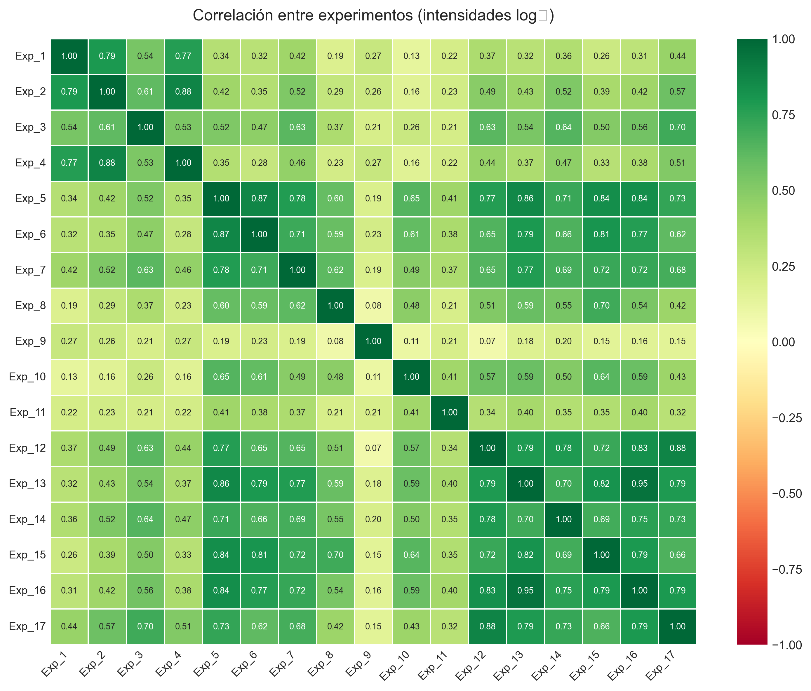
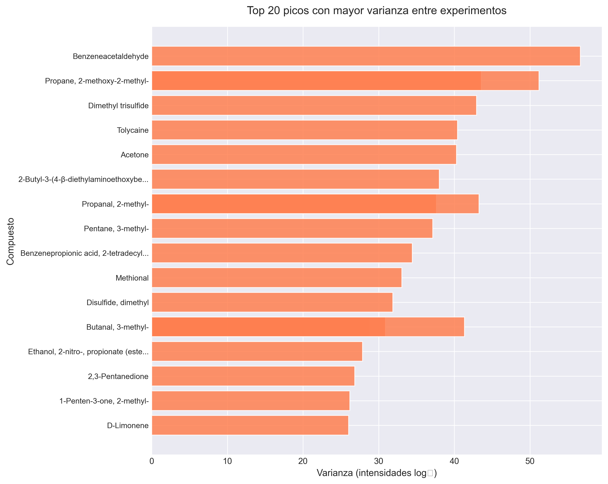
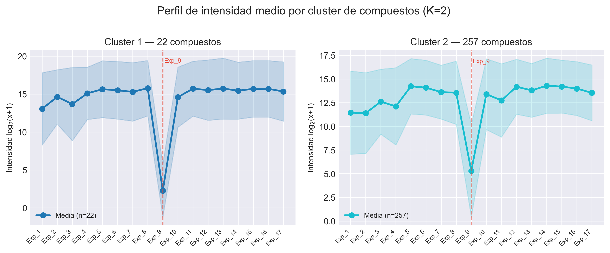
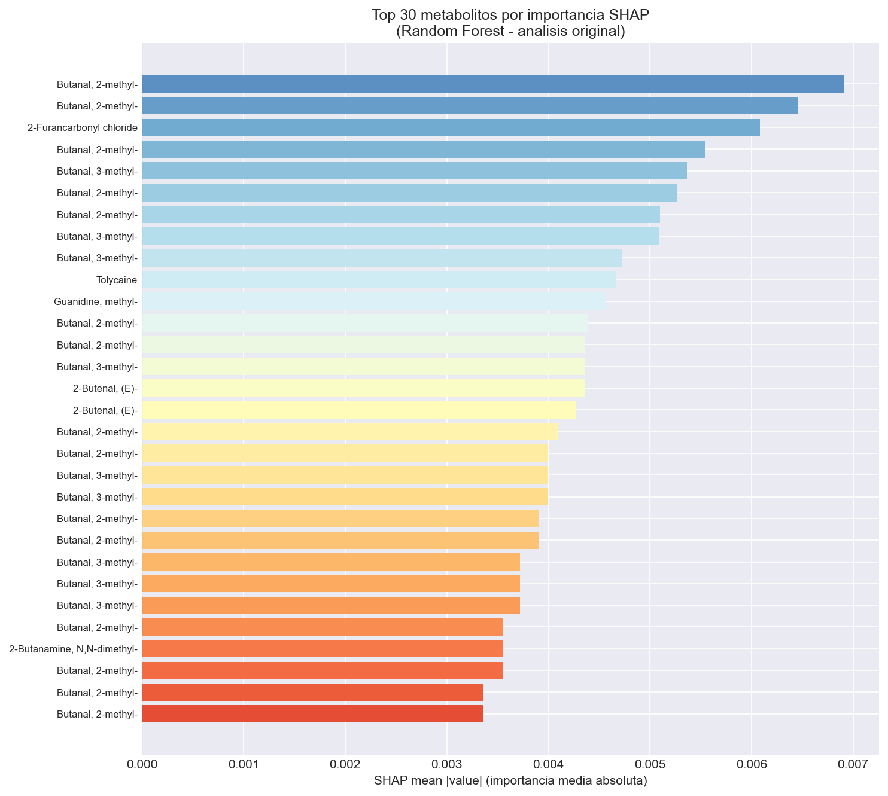
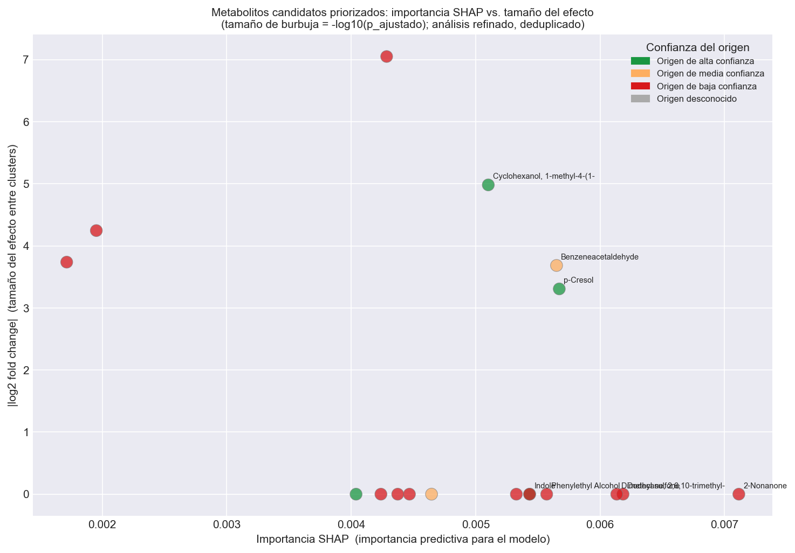
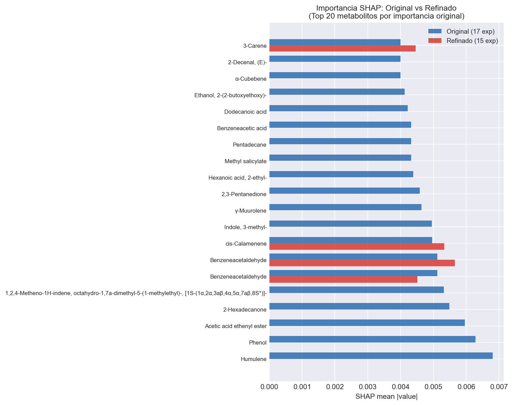
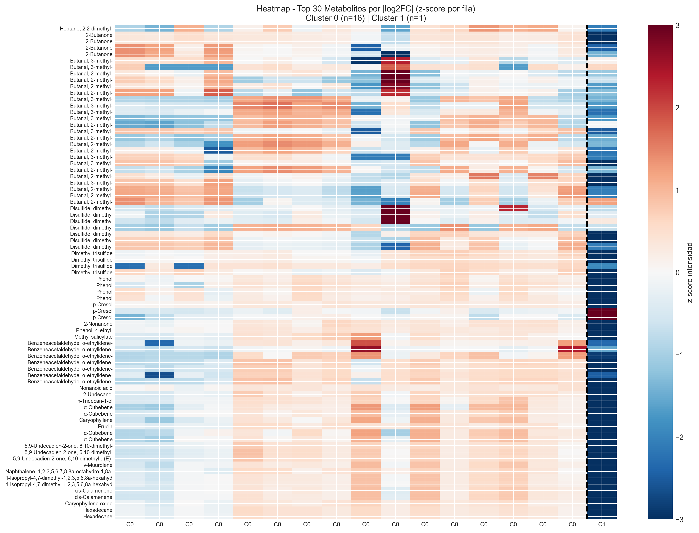

# Análisis Metabolómico: Identificación de Metabolitos Candidatos en Salud Mental con Python

## Descripción del proyecto

Este proyecto implementa un pipeline completo de análisis metabolómico aplicado a datos de cromatografía de gases acoplada a espectrometría de masas (GC-MS). Los datos proceden de 17 experimentos generados a partir de un conjunto de muestras anonimizado y generadas artificialmente ya que no se permite el uso de datos personales de participantes en el proyecto, en los que se detectaron aproximadamente 1.230 picos cromatográficos. Tras aplicar un filtrado por calidad de identificación espectral (Match Factor ≥ 700), se seleccionaron 279 metabolitos para el análisis, que posteriormente se anotaron frente a una base de datos de compuestos asociados a condiciones de salud mental.

El objetivo del proyecto es explorar estos perfiles metabolómicos para identificar metabolitos candidatos con patrones diferenciales entre grupos de muestras. Para ello se combinan técnicas de análisis exploratorio y métodos de aprendizaje automático. El pipeline incluye reducción de dimensionalidad mediante PCA, métodos de clustering no supervisado (clustering jerárquico y K-means), pruebas estadísticas con corrección FDR y una exploración mediante modelos de clasificación supervisada (Random Forest y XGBoost) junto con análisis de importancia de variables mediante SHAP.

## No se mostrarán todas las figuras, solamente las de mayor relevancia, para visualizar todas en conjunto revise el notebook

---

## Dataset

| Parámetro | Valor |
|-----------|-------|
| Experimentos | 17 muestras GC-MS |
| Picos cromatográficos totales | ~1.230 |
| Metabolitos tras control de calidad (Match Factor ≥ 700) | 279 |
| Anotados contra BD de salud mental | Sí |
| Transformación aplicada | log₂ + RobustScaler |
| Outliers identificados | Exp_9 (extremo), Exp_11 (moderado) |

Los datos crudos están en `data raw` y los datos procesados en `processed csv`.

---

## Pipeline del proyecto

| Notebook | Descripción |
|----------|-------------|
| [01 – Carga y contaminantes](notebooks/01_data_loading_and_contamination.ipynb) | Carga de los datos GC-MS desde Excel, eliminación de contaminantes comunes (silanos, siloxanos, derivados TMS, oximas) y selección de picos de calidad. |
| [02 – Anotación de metabolitos](notebooks/02_database_matching.ipynb) | Matching automático de los picos cromatográficos contra una base de datos de metabolitos asociados a salud mental, mediante coincidencia exacta e identificación de derivados. |
| [03 – Preprocesamiento](notebooks/03_preprocessing.ipynb) | Construcción de la matriz de intensidades, tratamiento de ceros como ausencia de detección, transformación log₂ para normalizar distribuciones y escalado robusto (RobustScaler). |
| [04 – Análisis exploratorio](notebooks/04_exploratory_analysis.ipynb) | PCA sobre los 17 experimentos, matriz de correlación entre muestras y análisis de los picos más variables para caracterizar la estructura global del dataset. |
| [05 – Clustering](notebooks/05_clustering.ipynb) | Clustering jerárquico (Ward) y K-Means sobre experimentos y compuestos, con selección de K mediante elbow y silhouette. Incluye análisis refinado sin los outliers detectados. |
| [06 – Tests estadísticos](notebooks/06_hypothesis_testing.ipynb) | Mann-Whitney U y Kruskal-Wallis con corrección FDR (Benjamini-Hochberg), análisis de fold change y volcano plots para ambos análisis (original y refinado). |
| [07 – Machine learning](notebooks/07_ml_pipeline.ipynb) | Clasificación por clusters con Random Forest y XGBoost usando validación Leave-One-Out (LOO-CV). Análisis de importancia de características con SHAP TreeExplainer. |
| [08 – Interpretación](notebooks/08_interpretation_and_biomarkers.ipynb) | Ranking integrado SHAP + fold change + p-valor con deduplicación, identificación de metabolitos candidatos priorizados por intersección de criterios y heatmap de abundancias z-score. |

El notebook [00 – Pipeline completo](notebooks/00_proyecto_completo.ipynb) integra todos los análisis anteriores en un único documento con interpretaciones de cada visualización.

---

## Resultados principales

- **PCA:** La primera componente principal explica el ~70% de la varianza total. Exp_9 aparece claramente separado del resto en todos los gráficos de PCA, lo que indica un perfil metabolómico extremadamente diferente al del grupo principal.
- **Outliers:** Exp_9 y Exp_11 se identificaron como experimentos atípicos mediante Isolation Forest, PCA y clustering jerárquico. Su exclusión es necesaria para un análisis biológicamente interpretable.
- **Clustering original (17 exp.):** K=2 separa Exp_9 (n=1) del grupo principal (n=16). El resultado está dominado por el outlier extremo.
- **Clustering refinado (15 exp.):** K=3 revela subestructura biológica real con tres grupos más equilibrados (n=4, n=10, n=1), inaccesible con los outliers presentes.
- **Tests estadísticos:** En el análisis original la potencia estadística es prácticamente nula (n=1 clase minoritaria). En el análisis refinado se obtienen p-valores más bajos (p=0.0077), aunque la corrección FDR sigue siendo conservadora.
- **Modelos ML:** Random Forest y XGBoost muestran buena separabilidad en LOO-CV. Los metabolitos con mayor importancia SHAP coinciden parcialmente con los mejor clasificados por fold change.
- **Metabolitos candidatos:** Phenol, p-Cresol y Humulene destacan en el análisis original; Cyclohexanol acetato y Benzeneacetaldehyde en el análisis refinado (intersección de ≥2 criterios).

---

## Figuras principales *(resto de figuras en el notebook completo)*

---

### Anotación de metabolitos – Resultados del matching


Resumen visual del proceso de anotación: proporción de picos con coincidencia exacta, coincidencia en caso de ser un compuesto derivado o sin match contra la base de datos de referencia. El umbral de Match Factor ≥ 700 garantiza que solo se retienen picos con una identidad química fiable para el análisis.

---

### Preprocesamiento – Distribución de intensidades y transformación log₂


Panel del preprocesamiento: distribución de intensidades por experimento antes y después de la transformación log₂ y el escalado robusto. La transformación corrige la fuerte asimetría de los datos del instrumento GC-MS y estabiliza la varianza entre muestras, condición necesaria para el análisis multivariante posterior.

---

### PCA de los 17 experimentos


El PCA muestra que la PC1 explica el ~70% de la varianza total del dataset. Exp_9 aparece como un outlier claro, completamente separado del resto de las muestras en el primer componente principal. Esta separación domina toda la estructura global del conjutno de datosque se aprecia en el notebook al completo y en las figuras que se muestran a continuación.

---

### Matriz de correlación de Pearson entre experimentos



La matriz de correlación cuantifica la similitud entre los 17 experimentos a partir de sus perfiles de intensidad. El bloque de alta correlación que forman la mayoría de las muestras confirma la cohesión del grupo principal sobre todo entre los experimentos 12 al 17, mientras que Exp_9 muestra valores notablemente bajos o negativos respecto al resto, reforzando su identificación como outlier extremo con una métrica independiente del PCA.

---

### Top 20 picos con mayor varianza entre experimentos



Los 20 picos cromatográficos con mayor varianza entre los 17 experimentos son los que más información aportan para distinguir entre muestras. Este gráfico identifica qué metabolitos presentan la señal más diferenciada a lo largo del dataset y orienta la selección de candidatos para el análisis posterior del clustering y del intento de machine learning.

---

### Dendrograma de clustering jerárquico


El dendrograma confirma la separación extrema de Exp_9, que forma una rama propia con el mayor enlace de disimilitud del árbol. El resto de los experimentos se agrupan en una rama compacta con distintos subgrupos internos.

---

### Perfil de intensidad media por cluster de compuestos



Perfil de intensidad media de los compuestos agrupados por cluster K-Means a lo largo de los 17 experimentos. Cada línea representa el patrón de abundancia promedio de un grupo de metabolitos, permitiendo identificar qué clusters de compuestos se sobreexpresan o infraexpresan en cada experimento y en qué grupos de muestras se concentra la señal diferencial.

---

### Clustermap combinado (análisis original)


El clustermap agrupa simultáneamente experimentos y metabolitos por similitud de perfil. Se observan dos bloques principales: Exp_9 con un patrón de abundancias radicalmente diferente, y el grupo principal formando un bloque compacto.

---

### Clustermap refinado (sin Exp_9 ni Exp_11)


Al excluir los outliers, el clustermap revela una estructura interna con tres grupos diferenciados. Se debe destacar que los gradientes de color son más intensos.

---

### Importancia SHAP – Top 20 metabolitos (análisis original)



Ranking de los metabolitos con mayor importancia SHAP media absoluta en el modelo Random Forest del análisis original. Los compuestos con valores SHAP más altos son los que más influyen en la capacidad del modelo para separar los clusters. Por ello, este gráfico permite identificar qué metabolitos tienen mayor peso predictivo en la clasificación.

---

### Metabolitos candidatos priorizados – Bubble plot (análisis refinado)



El bubble plot integra tres métricas simultáneamente: importancia SHAP (eje X), |log2FC| (eje Y) y evidencia estadística (tamaño de burbuja). Los candidatos en la zona superior derecha con burbujas grandes representan las señales metabólicas con mayor convergencia de evidencia.

---

### Comparación SHAP: análisis original vs. refinado



La comparación evidencia cómo Exp_9 distorsiona el ranking de importancia SHAP. Algunos metabolitos pierden relevancia al excluir el outlier, mientras que otros se vuelven más discriminantes en el contexto del grupo principal.

---

### Heatmap top 30 metabolitos por fold change (análisis original)



Heatmap de abundancias (z-score) de los 30 metabolitos con mayor fold change entre clusters, mostrando su distribución a lo largo de los 17 experimentos. Se observa que Exp_9 presenta un patrón diferenciado respecto al resto de muestras, mientras que el grupo principal muestra perfiles más homogéneos. Este comportamiento explica en parte la separación observada en los análisis multivariantes.

---

### Fold change ranking – Análisis refinado


Ranking de los metabolitos con mayor fold change absoluto en el análisis refinado (15 experimentos, 3 clusters). Los compuestos situados a ambos extremos del gráfico muestran las mayores diferencias de abundancia entre clusters. Al eliminar los outliers, los cambios observados son más moderados y reflejan mejor las diferencias metabólicas dentro del grupo principal de muestras.

---

### ML – Resultados y métricas (análisis refinado)


Resultados de Random Forest y XGBoost en el análisis refinado. Las matrices de confusión muestran que la mayoría de las muestras se clasifican correctamente, aunque el tercer cluster resulta más difícil de identificar, probablemente por su menor tamaño. El ranking de importancia del modelo señala además los metabolitos que más contribuyen a la separación entre grupos. En conjunto, las métricas de validación indican un buen rendimiento de los modelos.

---

## Conclusiones

ras el preprocesamiento y filtrado de los datos, el conjunto final quedó constituido por 279 metabolitos detectados en 17 experimentos, todos ellos con match espectral superior a 700, eliminándose además compuestos asociados a contaminantes analíticos como silanos u otros artefactos instrumentales. Este filtrado permitió centrar el análisis en metabolitos con mayor fiabilidad de identificación y potencial relevancia biológica.

El análisis exploratorio mediante PCA, matrices de correlación y métodos de clustering mostró que la mayoría de los experimentos presentan perfiles metabolómicos relativamente consistentes. No obstante, Exp_9 aparece de forma sistemática como un experimento atípico, tanto en los análisis multivariantes como en los métodos de detección de outliers, además de presentar un número significativamente mayor de metabolitos no detectados.

Una vez excluidos los experimentos más extremos, el análisis refinado permitió identificar con mayor claridad la estructura del conjunto principal de datos. La combinación de análisis estadísticos y modelos de machine learning permitió priorizar metabolitos candidatos potencialmente relevantes, integrando métricas como el tamaño del efecto, la significación estadística y la importancia de las variables en los modelos predictivos.

Finalmente, comparando la cobertura metabolómica de los distintos experimentos, Exp_12 y Exp_15 destacan por presentar el menor número de metabolitos no detectados dentro del grupo principal. Entre ellos, Exp_12 muestra el mejor equilibrio entre número de metabolitos detectados y estabilidad del perfil analítico, por lo que se propone como la condición experimental más adecuada para futuros análisis de muestras de pacientes y controles.

---

## Estructura del repositorio

```
Proyecto_Picos/
├── data/
│   ├── raw/                          # Datos crudos (Excel GC-MS y BD metabolitos)
│   └── processed/                    # Matrices procesadas y resultados intermedios
├── figures/                          # Figuras generadas por el Notebook 08
├── notebooks/
│   ├── 00_proyecto_completo.ipynb    # Pipeline completo integrado con interpretaciones
│   ├── 01_data_loading_and_contamination.ipynb
│   ├── 02_database_matching.ipynb
│   ├── 03_preprocessing.ipynb
│   ├── 04_exploratory_analysis.ipynb
│   ├── 05_clustering.ipynb
│   ├── 06_hypothesis_testing.ipynb
│   ├── 07_ml_pipeline.ipynb
│   └── 08_interpretation_and_biomarkers.ipynb
├── results/
│   └── figures/                      # Figuras generadas por los notebooks 01–07
└── README.md
```

---

> El análisis detallado, incluyendo todo el código, las visualizaciones y las interpretaciones paso a paso, está disponible en los notebooks individuales o en el notebook integrado `notebooks/00_proyecto_completo.ipynb`.
